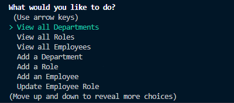

# EMPLOYEE TRACKER

## Description

This is an EMS application useable in terminal to track employee data by role and department.

## Installation

### Clone the repository to your local machine
### Make sure [Node.js](https://nodejs.org/en/download/) is downloaded and installed 
### Open a terminal, navigate to the cloned directory, and open it with your source-code editor
### Type the command 'npm install' to install all project dependencies
### Log in to your mysql and source the schema.sql and seeds.sql files
### Create a .env file with your password listed to run properly
### Run the program by typing 'node server'
### Video Walkthrough:
https://www.youtube.com/watch?v=GX51T2kOQaY&ab_channel=Weelz

## Usage

### When you run the server, a prompt will appear

### From here you can view or add departments, roles, or employees
### When adding, a new prompt will appear relevant to the choice being added
### You can also update employee's roles by navigating to that selection

## Questions

Created by: [CWheelsRun](https://github.com/CWheelsRun)
  
If you have any further questions please feel free to contact me at [corey.bennett@live.com](corey.bennett@live.com)